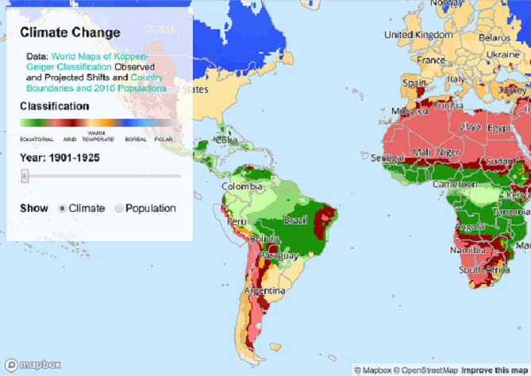

### an interactive web map application showing global climate and population information created using Mapbox Studio and Mapbox GL JS, view the full beginner's guide to coding with Mapbox blog post [here](https://danahuget.home.blog/2020/01/07/a-modern-web-mapping-application-guide/)

